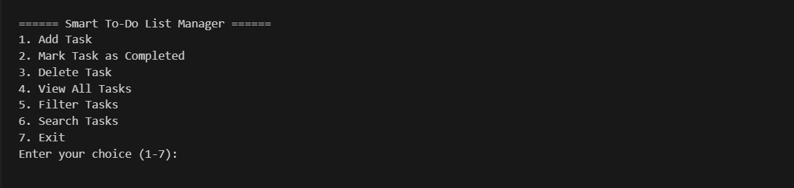

<<<<<<< HEAD
<<<<<<< HEAD
# Smart To-Do List Manager (Python Project)

## 📌 Objective

A simple **Command-Line To-Do List Manager** built using **pure Python** (without Pandas or external libraries).  
It allows users to manage their daily tasks with the following features:

- Add new tasks
- Mark tasks as completed
- Delete tasks
- View all tasks (color-coded priority)
- Filter tasks (Pending, Completed, Due Today/Tomorrow, Overdue)
- Search tasks by title or description
- Automatic overdue detection
- Data stored in `tasks.json` file (auto-created if missing)

---

## 🚀 Features Implemented

✔️ **Add Task** — Auto-incremented ID, Pending by default  
✔️ **Mark as Completed** — Adds completion timestamp  
✔️ **Delete Task** — Remove by ID  
✔️ **View All Tasks** — Sorted by Overdue/High/Medium/Low, with color-coded Priority  
✔️ **Filter Tasks** — Pending / Completed / Due Today / Due Tomorrow / Overdue  
✔️ **Search Tasks** — By title or description (case-insensitive)  
✔️ **Automatic Overdue Detection** — Checks dates and marks overdue tasks  
✔️ **File I/O** — Persistent storage using JSON (`tasks.json`)

---

## 🏗️ Folder Structure

---

## 🖥️ How to Run This Project

### Step 1: Open **Command Prompt (CMD)** or **VS Code Terminal**.

### Step 2: Change directory to the project folder:

### Step 3: Run the Python program:

## 📋 Sample Menu:

---
=======
# Smart-to-Do-LIst
>>>>>>> dd7a655f33ff7a19545fe43b9d7573a0cf
=======
# Smart-to-Do-LIst
>>>>>>> e1d67bc170f242d8a4e88f5676ec57449902dc0d
