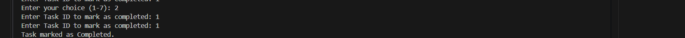
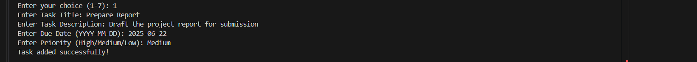
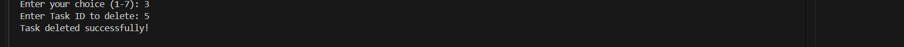
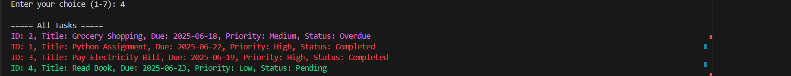
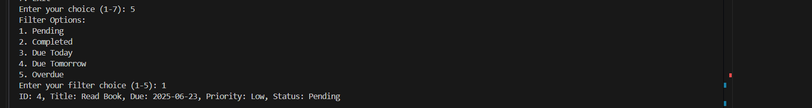
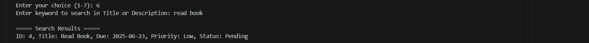

<<<<<<< HEAD

# Smart To-Do List Manager (Python Project)

## 📌 Objective

A simple **Command-Line To-Do List Manager** built using **pure Python** (without Pandas or external libraries).  
It allows users to manage their daily tasks with the following features:

- Add new tasks
- Mark tasks as completed
- Delete tasks
- View all tasks (color-coded priority)
- Filter tasks (Pending, Completed, Due Today/Tomorrow, Overdue)
- Search tasks by title or description
- Automatic overdue detection
- Data stored in `tasks.json` file (auto-created if missing)

---

## Features Implemented

**Add Task** — Auto-incremented ID, Pending by default  
 **Mark as Completed** — Adds completion timestamp  
 **Delete Task** — Remove by ID  
 **View All Tasks** — Sorted by Overdue/High/Medium/Low, with color-coded Priority  
 **Filter Tasks** — Pending / Completed / Due Today / Due Tomorrow / Overdue  
 **Search Tasks** — By title or description (case-insensitive)  
 **Automatic Overdue Detection** — Checks dates and marks overdue tasks  
 **File I/O** — Persistent storage using JSON (`tasks.json`)

---

## Folder Structure

---

## How to Run This Project

### Step 1: Open **Command Prompt (CMD)** or **VS Code Terminal**.

### Step 2: Change directory to the project folder:

### Step 3: Run the Python program:

## Sample Menu:

<<<<<<< HEAD

---

=======

# Smart-to-Do-LIst

====== Smart To-Do List Manager ======

1. Add Task
   
2. Mark Task as Completed
   
3. Delete Task
   
4. View All Tasks
  
5. Filter Tasks
  
6. Search Task by Title or Keyword
 
7. Exit
  
   Enter your choice (1-7):
=======
>>>>>>> 7fab8f9af575550fbceffcbbcb1c596305fc77ba
